# ai-up-rag

A Retrieval-Augmented Generation (RAG) architecture using Odoo as the backend and OpenAI as the LLM for Universidad Panamericana.

# 🚀 AI UP RAG

## 📌 Instructions to run the microservices stack locally (Ubuntu)

## 🎆 Setup

0. If you are working on Windows, we recommend using WSL.
1. Install Docker and ensure it is running properly. You can use Docker Desktop.
2. Clone this repository and update the prompt in the file `odoo/custom-addons/ai_up_messaging/models/open_ai_llm.py`.

This prompt is used to define the personality of the LLM when answering chat queries.

3. Duplicate the file `.env.example` in the `setup` folder and rename it to `.env`.

4. Add your OpenAI API key to the `.env` file:

```bash
OPENAI_API_KEY=your_api_key_here
```

5. Duplicate the file `example.odoo.conf` in the `setup/config` folder and rename it to `odoo.conf`.

6. Install `make`:

```bash
sudo apt-get update
sudo apt-get install make
```

## ⚙️ Configuration

1. Run the following command to start the containers:

```bash
make dev
```

2. Access the Odoo application at http://localhost:8069/.
   You can find the master password in the `odoo.conf` file.

   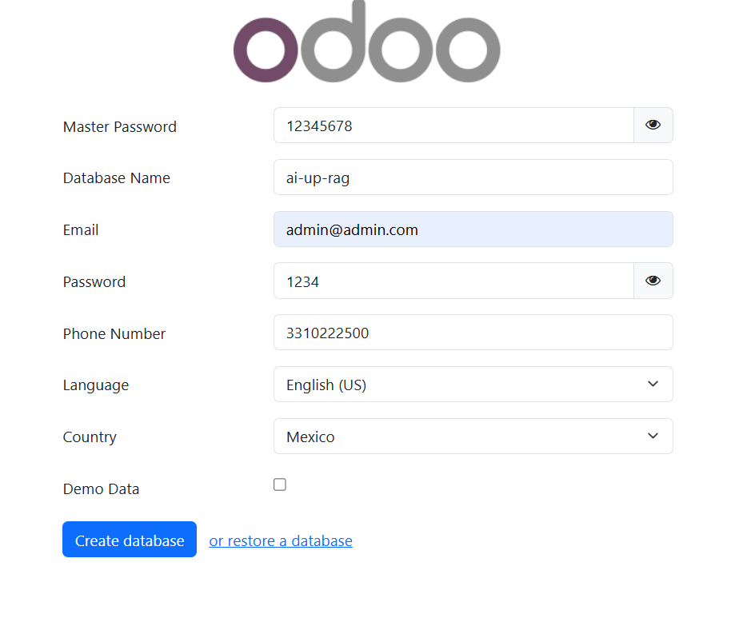

   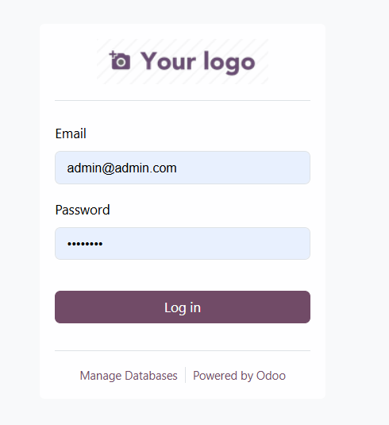

   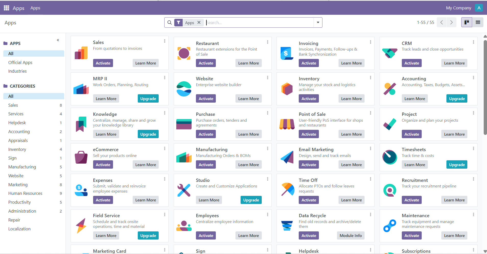

3. Activate Developer Mode in Odoo to install the custom add-ons.

    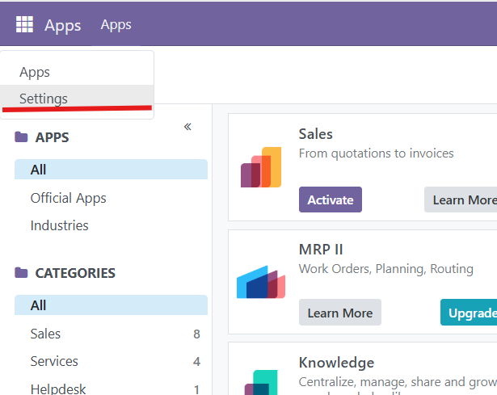

    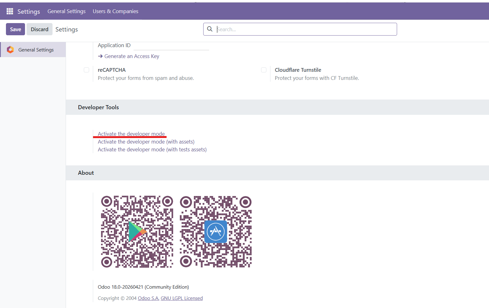

4. Install the custom add-ons. Make sure to clear the "Apps" filter before searching for "ai_up" in the Apps search bar.

    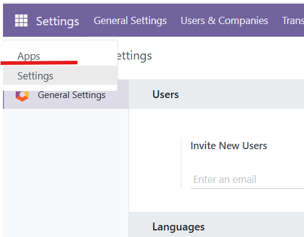
    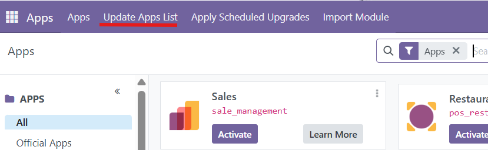
    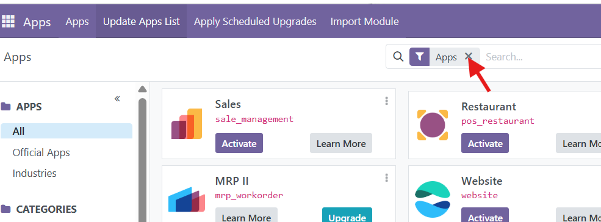
    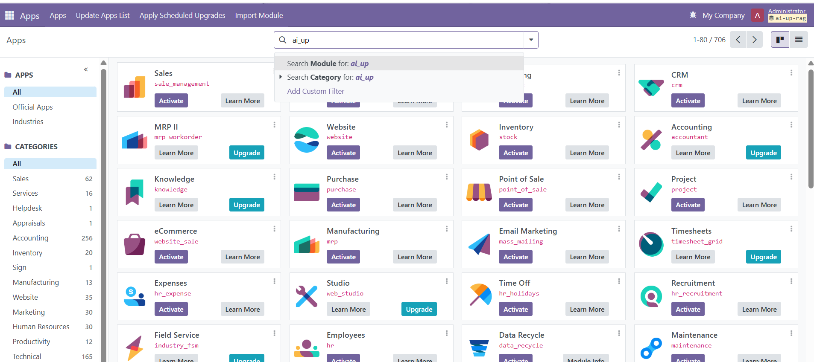
    4.1 install the modules in the following order:  
    AI UP Vectorizer    
    AI UP Vectorizer Pg Vector  
    AI UP Advertisements  
    AI UP Advertisements Vectorizer  
    AI up Message History  
    AI UP Messaging   
    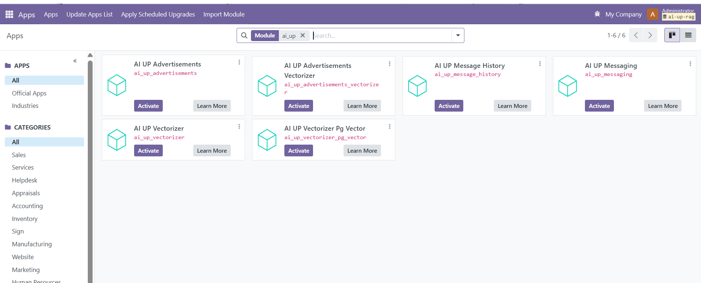

5. Select the vectorizer provider.
    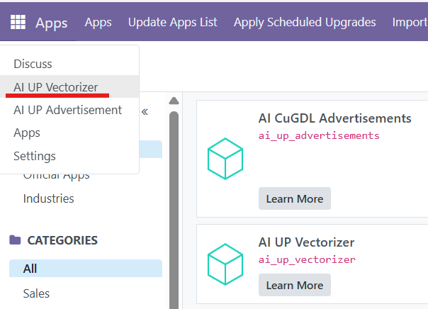
    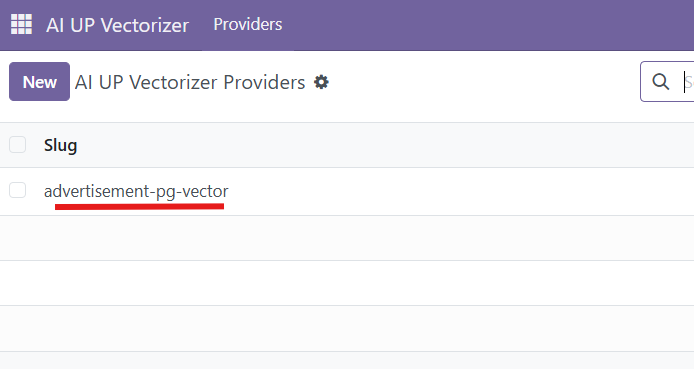

6. Create interested parties.
    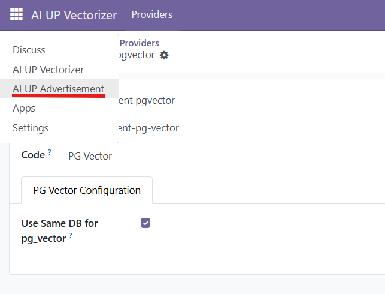
    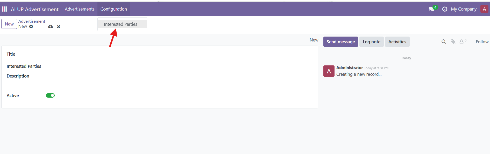

    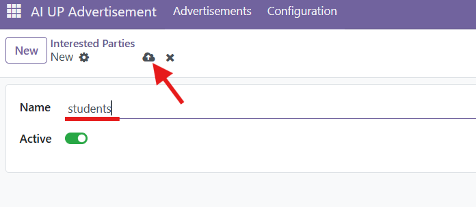

7. Create an advertisement. The first time an advertisement is created, the system may take a while because it downloads a model from the internet.

    

    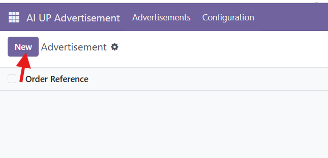

    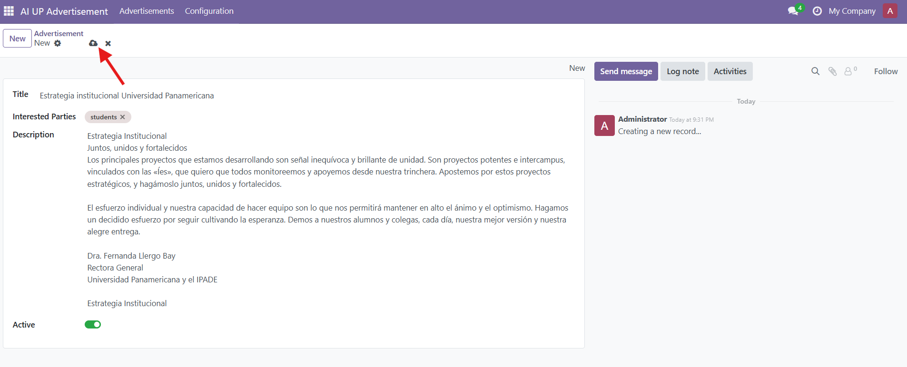

    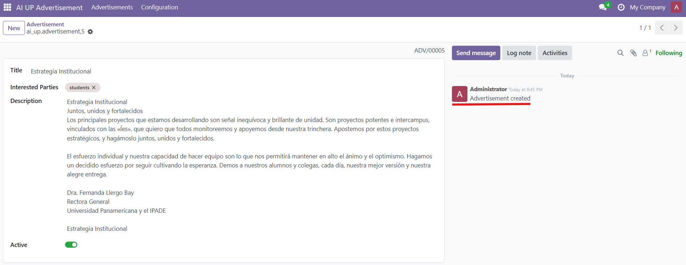


8. At this point, you can query the RAG system via the API at http://localhost:8069/api/v1/whatsapp/answers using a POST request and sending the `from_phone` and `message` fields.

```json
{
  "from_phone": "3310222500",
  "message": "cual es la estrategia de la universidad panamericana"
}
```

  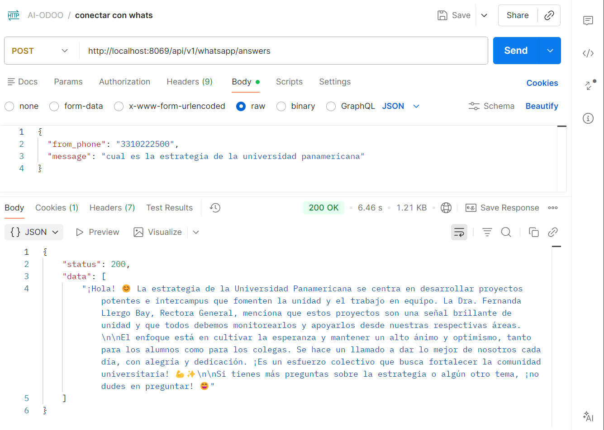

## 🔍 Querying Data

1. Access the pgAdmin application at http://localhost:5050/. Use the credentials defined in the `.env` file.

    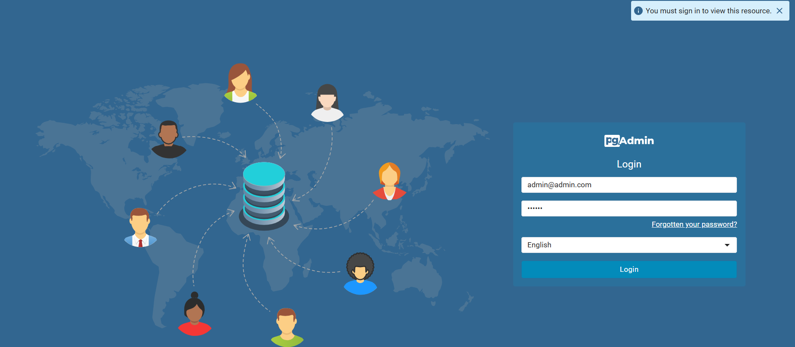

2. Register a server using the database connection information from the `.env` file (host, user, and password).

    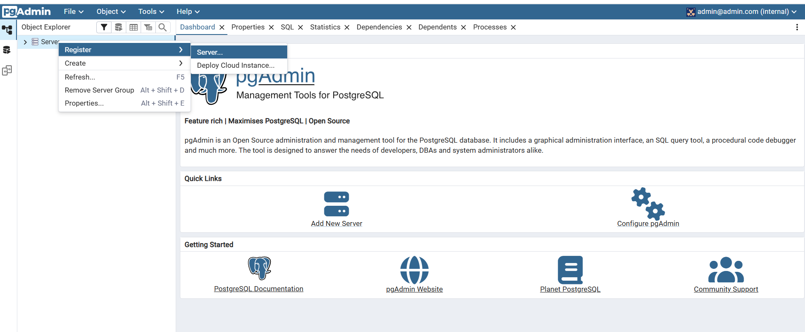
    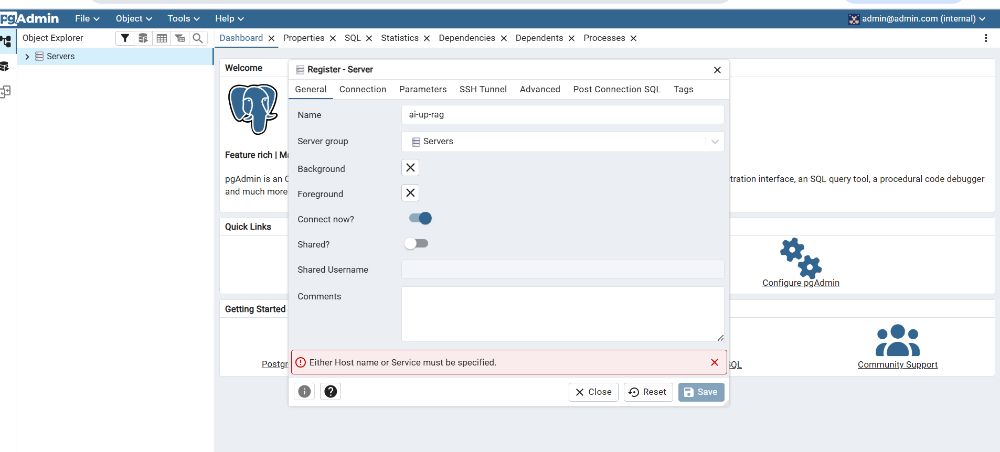
    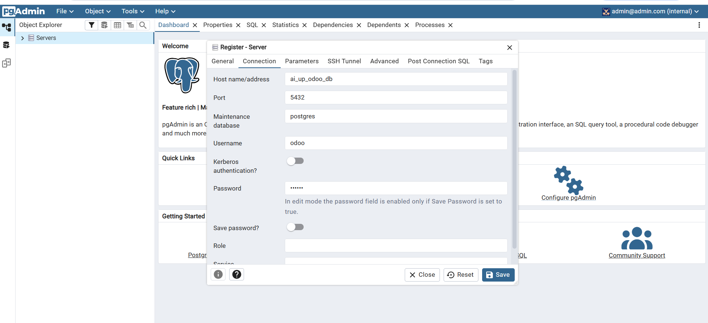

3. Query the RAG user interactions using SQL on the `mail_message` table.

    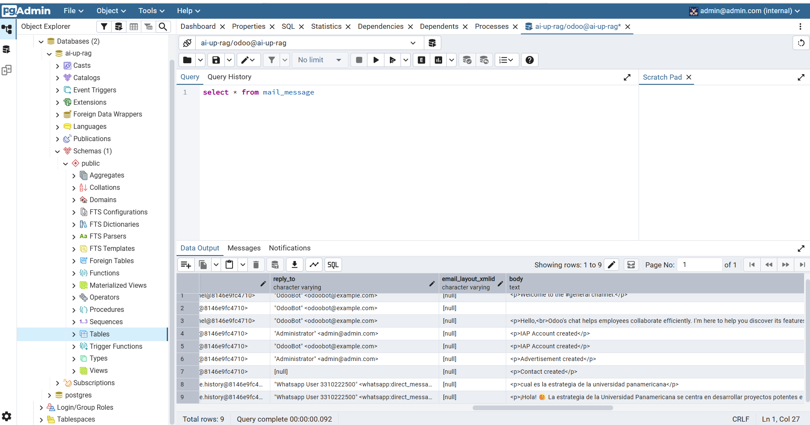