# ☁️ Deploy on an AWS virtual machine (EC2)

This guide deploys AI UP RAG on an Ubuntu EC2 instance with HTTPS. Traffic goes through [nginx-proxy + Let's Encrypt](https://github.com/SHFSAS/documentacion-docker), which routes each domain to its container and issues the SSL certificates automatically.

```
Internet ──► :80/:443 nginx-proxy ──► ai_up_odoo (8069)          odoo.example.com
                  │                ──► ai_up_odoo_pgadmin (80)   pgadmin.example.com
          letsencrypt companion         │
          (issues certificates)         ▼
                                   ai_up_odoo_db (pgvector, internal only)
```

The server uses `setup/docker-compose.server.yml`. It differs from the local `setup/docker-compose.yml` in that it does not publish ports `8069` and `5050`: everything enters through the proxy on ports 80 and 443.

> **Placeholders:** this guide uses `odoo.example.com`, `pgadmin.example.com` and `admin@example.com`. Replace them with your own domains and email.

## 1. Create the EC2 instance

In the AWS console go to **EC2** > **Launch instance** and configure:

| Setting | Value |
|---------|-------|
| **AMI** | Ubuntu Server 24.04 LTS |
| **Instance type** | `t3.xlarge` (4 vCPU, 16 GiB) recommended. `t3.large` (8 GiB) is the minimum. |
| **Key pair** | Create or select one. You will need it to connect via SSH. |
| **Storage** | 30 GiB `gp3` or more |

The Odoo container reserves 4 GiB and can use up to 8 GiB of RAM, because it loads the embeddings model and PyTorch. With less memory the build or the first advertisement can fail.

In **Network settings**, create a security group with these inbound rules:

| Type | Port | Source | Why |
|------|------|--------|-----|
| SSH | 22 | My IP | Server administration |
| HTTP | 80 | Anywhere | Let's Encrypt validation and redirection to HTTPS |
| HTTPS | 443 | Anywhere | Access to Odoo, pgAdmin and the API |

Do not open ports 8069, 5050 or 5432.

Once the instance is running, go to **EC2** > **Elastic IPs** > **Allocate Elastic IP address** and associate it with the instance. Without an Elastic IP the public IP changes every time the instance is stopped, and the domains stop working.

## 2. Configure the DNS

In your DNS provider, create two `A` records pointing to the Elastic IP:

| Type | Name | Value |
|------|------|-------|
| A | `odoo.example.com` | `<ELASTIC_IP>` |
| A | `pgadmin.example.com` | `<ELASTIC_IP>` |

If you use **Cloudflare**, keep the proxy **disabled** (gray cloud, "DNS only") until the certificates are issued. Otherwise Let's Encrypt cannot validate the domain.

Check that the domains resolve to your IP before continuing:

```bash
nslookup odoo.example.com
```

## 3. Prepare the server

Connect via SSH (on Ubuntu AMIs the user is `ubuntu`):

```bash
ssh -i /path/to/your-key.pem ubuntu@<ELASTIC_IP>
```

Install Docker, Docker Compose, Git and Make:

```bash
sudo apt-get update
sudo apt-get install -y git make
curl -fsSL https://get.docker.com | sudo sh
```

Allow your user to run Docker without `sudo`, then close the SSH session and connect again so the change takes effect:

```bash
sudo usermod -aG docker $USER
exit
```

Check the installation:

```bash
docker --version
docker compose version
```

Create the external network `web`. The proxy and the public containers communicate through it:

```bash
docker network create web
```

## 4. Start nginx-proxy and Let's Encrypt

Clone the proxy repository:

```bash
cd ~
git clone https://github.com/SHFSAS/documentacion-docker.git
cd documentacion-docker/nginx-proxy
```

Edit `docker-compose.yml` before starting it:

- In the `letsencrypt` service, change `DEFAULT_EMAIL` to your email (`admin@example.com`).
- Both services mount the certificates from `/home/user/tools/nginx_webproxy/certificats`. You can keep that path (Docker creates it), or change it in **both** services to a path in your home, for example `/home/ubuntu/certs`.

Start the proxy:

```bash
docker compose up -d
docker ps
```

You should see two containers running: the proxy (`jwilder/nginx-proxy`) and the companion (`jrcs/letsencrypt-nginx-proxy-companion`).

The proxy only needs to be started once per server. It serves every project connected to the `web` network.

## 5. Download and configure AI UP RAG

Clone the repository:

```bash
cd ~
git clone <URL_OF_THIS_REPOSITORY> ai-up-rag
cd ai-up-rag
```

Create the environment file and set **strong passwords**, since the server is public:

```bash
cp setup/.example.env setup/.env
nano setup/.env
```

| Variable | Value |
|----------|-------|
| `OPENAI_API_KEY` | Your OpenAI API key |
| `POSTGRES_PASSWORD` and `PASSWORD` | The same strong password for the database |
| `PGADMIN_DEFAULT_EMAIL` | Your email to log in to pgAdmin |
| `PGADMIN_DEFAULT_PASSWORD` | A strong password for pgAdmin |

Create the Odoo configuration file and change `admin_passwd` (the Odoo master password) to a strong value:

```bash
cp setup/config/example.odoo.conf setup/config/odoo.conf
nano setup/config/odoo.conf
```

Keep `proxy_mode = 1`. Odoo needs it to work correctly behind nginx.

Edit `setup/docker-compose.server.yml` and replace the placeholders:

| Service | Variables | Replace with |
|---------|-----------|--------------|
| `ai_up_odoo` | `VIRTUAL_HOST`, `LETSENCRYPT_HOST` | `odoo.example.com` → your Odoo domain |
| `pgadmin` | `VIRTUAL_HOST`, `LETSENCRYPT_HOST` | `pgadmin.example.com` → your pgAdmin domain |
| both | `LETSENCRYPT_EMAIL` | `admin@example.com` → your email |

Do not change `VIRTUAL_PORT`. It is the port **inside** the container (`8069` for Odoo and `80` for pgAdmin), not a port of the server.

## 6. Start the application

From the root of the repository:

```bash
make prod
```

This builds the image and starts the containers in the background. The first build takes several minutes because it downloads PyTorch.

Follow the logs until Odoo is ready:

```bash
make prod-logs
```

Wait 1 to 2 minutes for Let's Encrypt to issue the certificates. You can follow the process in the companion logs (the container name may vary, check it with `docker ps`):

```bash
docker logs -f --tail 20 <letsencrypt-container-name>
```

Then open https://odoo.example.com. If you use Cloudflare, you can re-enable its proxy (orange cloud) once the site loads with HTTPS.

Useful commands on the server:

| Command | Description |
|---------|-------------|
| `make prod` | Rebuild and restart the whole stack |
| `make prod-restart` | Restart only Odoo |
| `make prod-logs` | Follow the logs |

## 7. Configure Odoo

These are the same steps as in the local installation, but using your domain instead of `localhost:8069`.

1. Open https://odoo.example.com and create the database. Use the `admin_passwd` from `setup/config/odoo.conf` as the **Master Password**, choose a database name, the administrator email and password, and language `English (US)`. Leave **Demo data** unchecked.

   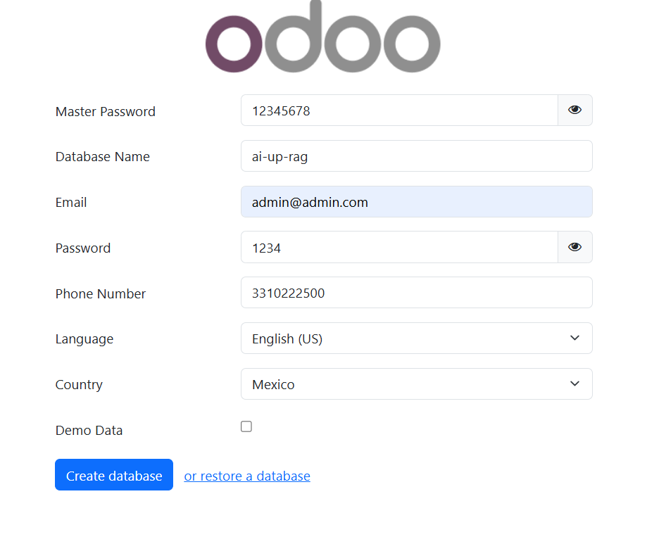

   Log in with the administrator user you just created.

   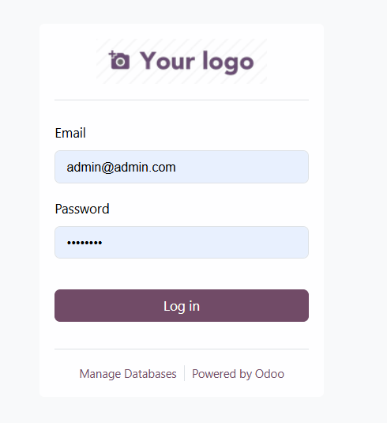

   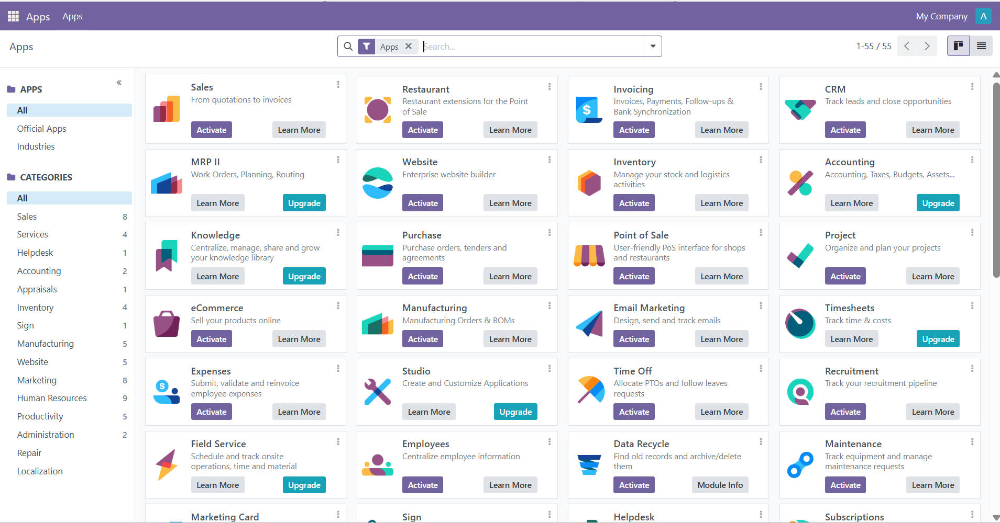

2. Activate Developer Mode: **Settings** > scroll to the bottom > **Activate the developer mode**.

   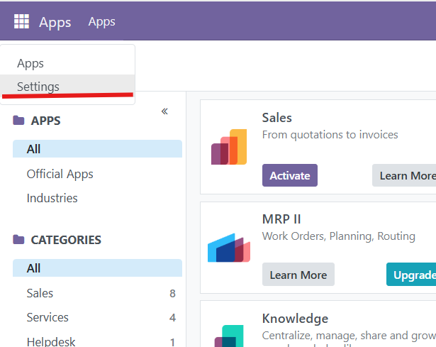

   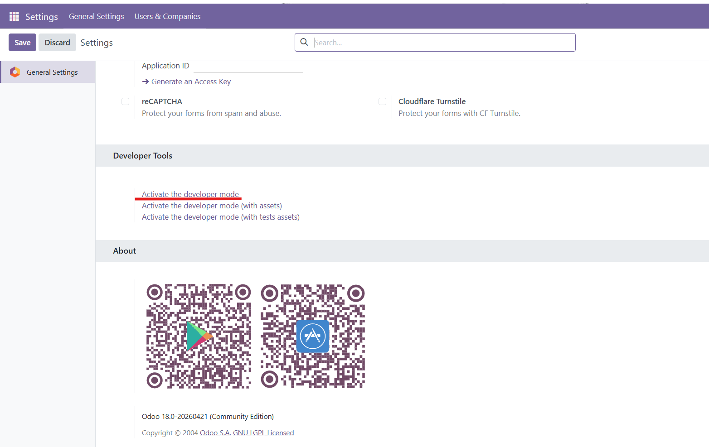

3. Install the add-ons. Go to **Apps** > **Update Apps List**, remove the **Apps** filter from the search bar and search for `ai_up`.

   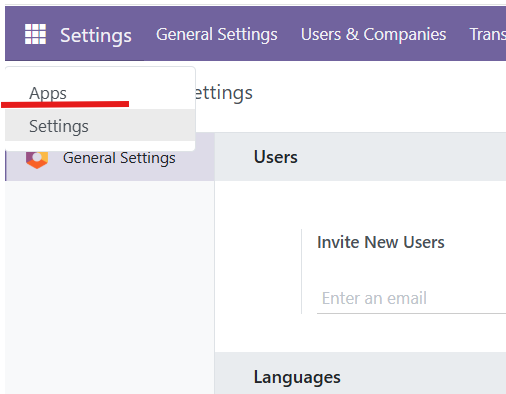
   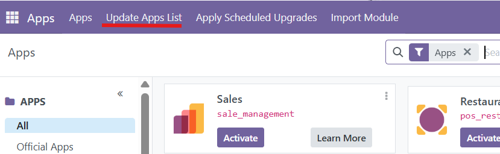
   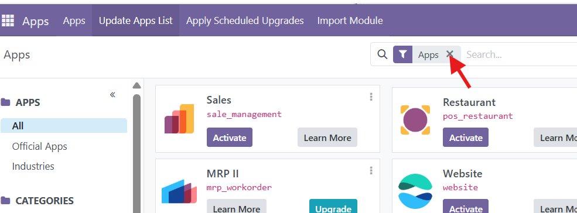
   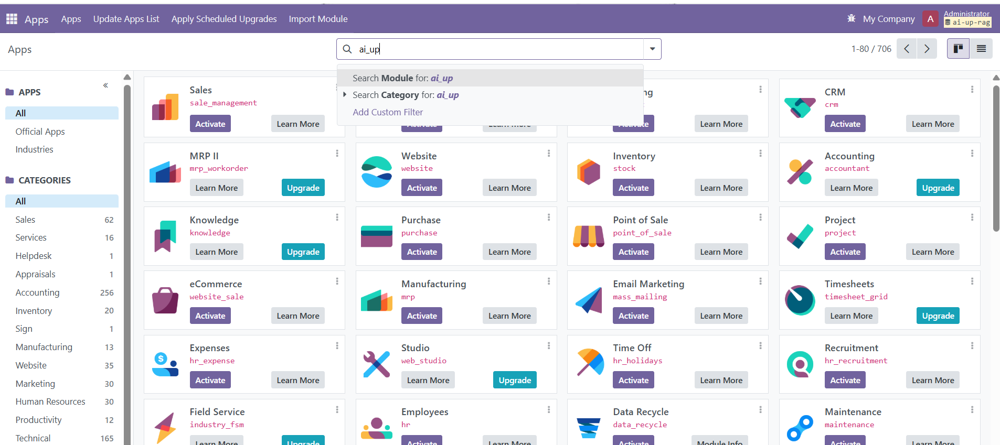

   Activate the modules **one at a time, in this order**:

   1. AI UP Vectorizer
   2. AI UP Vectorizer Pg Vector
   3. AI UP Advertisements
   4. AI UP Advertisements Vectorizer
   5. AI up Message History
   6. AI UP Messaging

   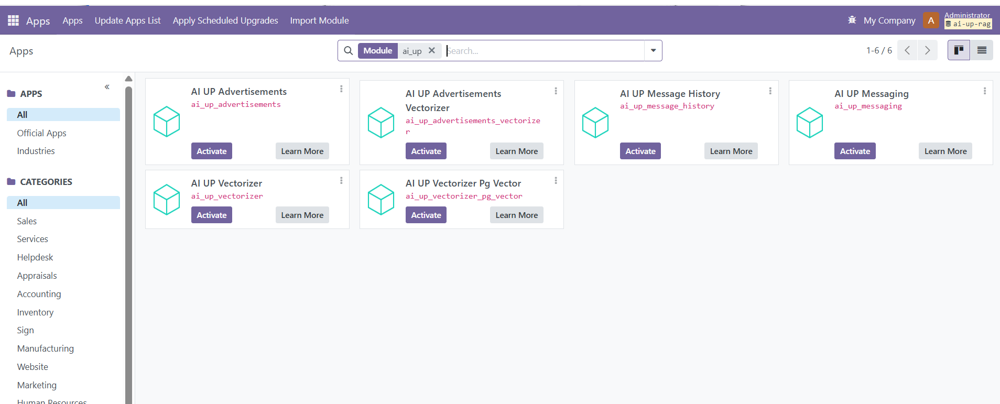

4. Check the vectorizer provider. In **AI UP Vectorizer** > **Providers**, open **Advertisement pgvector** and check that **Code** is `PG Vector` and **Use Same DB for pg_vector** is checked.

   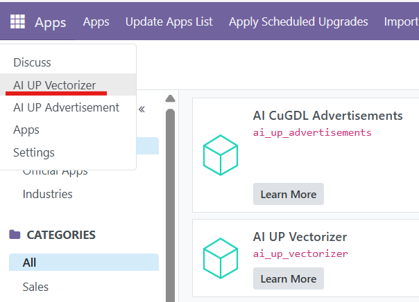
   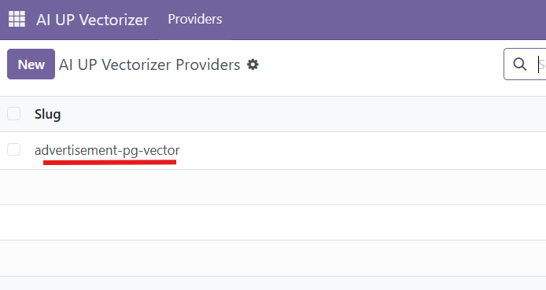

5. Create interested parties: **AI UP Advertisement** > **Configuration** > **Interested Parties** > **New**.

   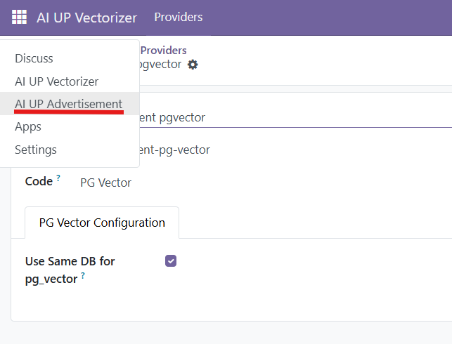
   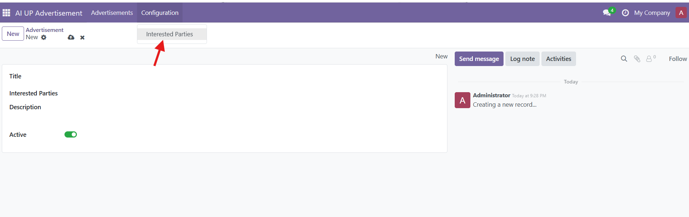
   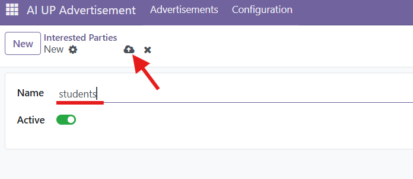

6. Create an advertisement: **AI UP Advertisement** > **Advertisements** > **New**. The first save takes several minutes because the embeddings model is downloaded. Follow it with `make prod-logs`.

   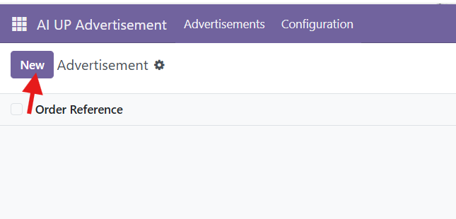
   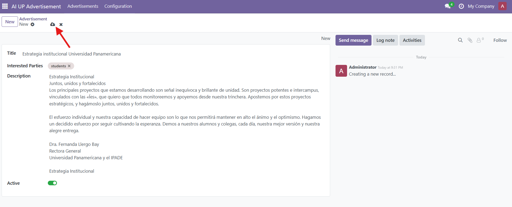
   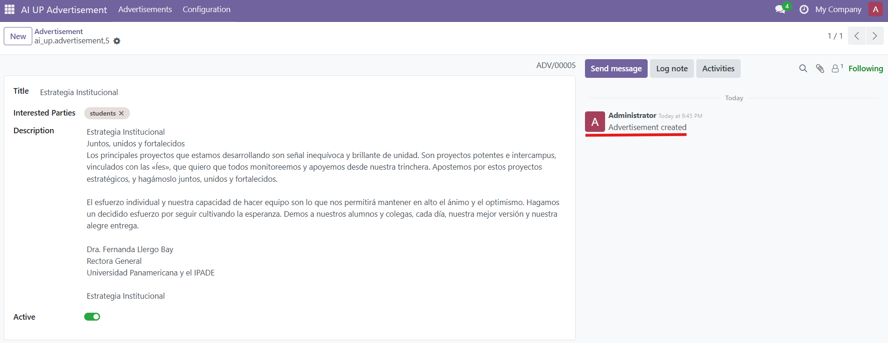

## 8. Test the API

```bash
curl -X POST https://odoo.example.com/api/v1/whatsapp/answers \
  -H "Content-Type: application/json" \
  -d '{"from_phone": "3310222500", "message": "cual es la estrategia de la universidad panamericana"}'
```

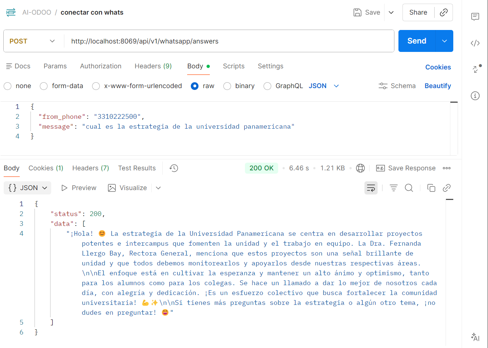

## 9. Query the database with pgAdmin

Open https://pgadmin.example.com and log in with `PGADMIN_DEFAULT_EMAIL` and `PGADMIN_DEFAULT_PASSWORD`.

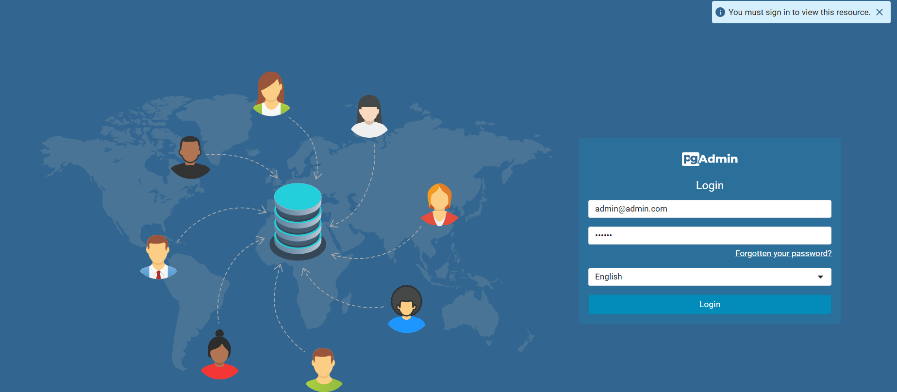

Register the server with **Host name/address** `ai_up_odoo_db`, port `5432`, and the `POSTGRES_USER` / `POSTGRES_PASSWORD` from `setup/.env`.

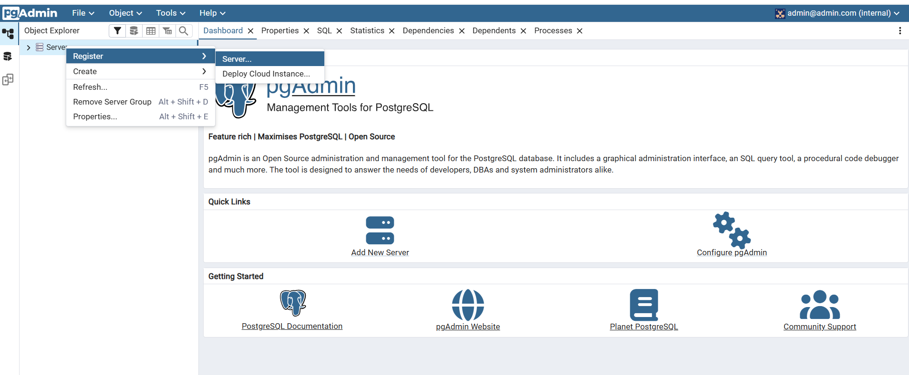
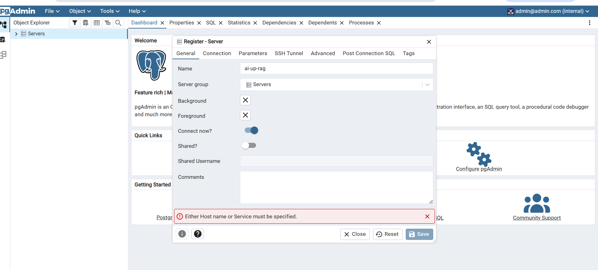
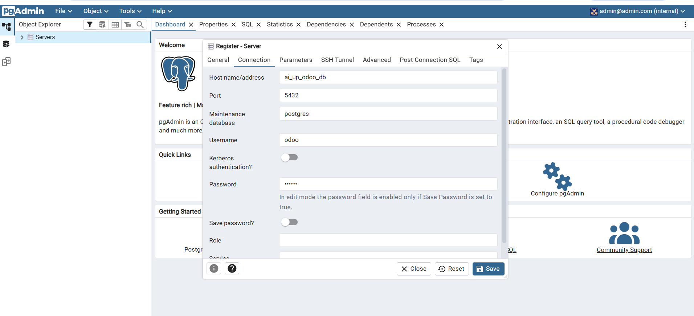

The conversations are stored in the `mail_message` table:

```sql
SELECT id, create_date, email_from, author_id, body
FROM mail_message
WHERE model = 'ai_up.message.history'
ORDER BY id DESC;
```

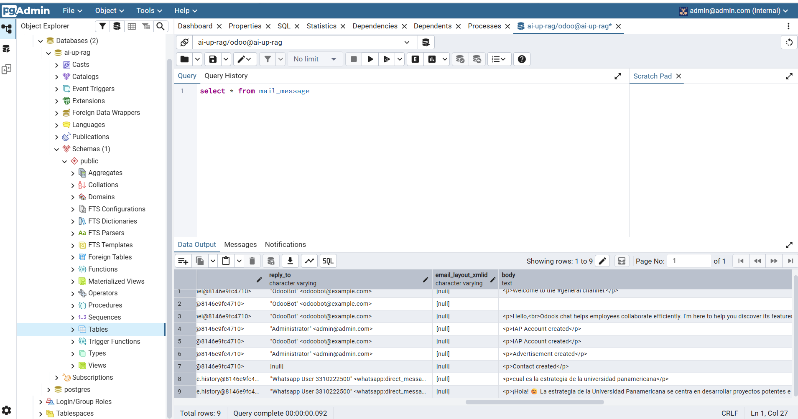

## 10. Update the application

To deploy new changes:

```bash
cd ~/ai-up-rag
git pull
make prod
```

If the changes modify an Odoo add-on, upgrade the module afterwards: **Apps** > search the module > **Upgrade**.

The data (database, Odoo files, embeddings model and pgAdmin) is stored in Docker volumes, so it is kept when the containers are recreated. Do not run `docker compose down -v`, because `-v` deletes the volumes.

## 🧯 Troubleshooting

| Problem | Cause and solution |
|---------|--------------------|
| **502 Bad Gateway** | The container has an error or has not started yet. Wait a moment and check the logs with `make prod-logs`. |
| **503 Service Unavailable** | nginx-proxy does not recognize the domain. Check `VIRTUAL_HOST` in `setup/docker-compose.server.yml`, check that the container is on the `web` network, and run `make prod` again. |
| **The certificate is not issued** (the browser shows a certificate warning) | Check that the DNS points to the Elastic IP, that port 80 is open in the security group, and that the Cloudflare proxy is disabled. Then check the companion logs. |
| **`contact email has forbidden domain "example.com"`** in the companion logs | The placeholders were not replaced. Change `LETSENCRYPT_EMAIL` in `setup/docker-compose.server.yml` (and `DEFAULT_EMAIL` in the proxy) to a real email, then run `make prod` again. |
| **`network web declared as external, but could not be found`** | Create the network with `docker network create web`. |
| **The build fails or Odoo restarts when saving an advertisement** | The instance does not have enough memory. Use an instance with more RAM (see step 1). |
